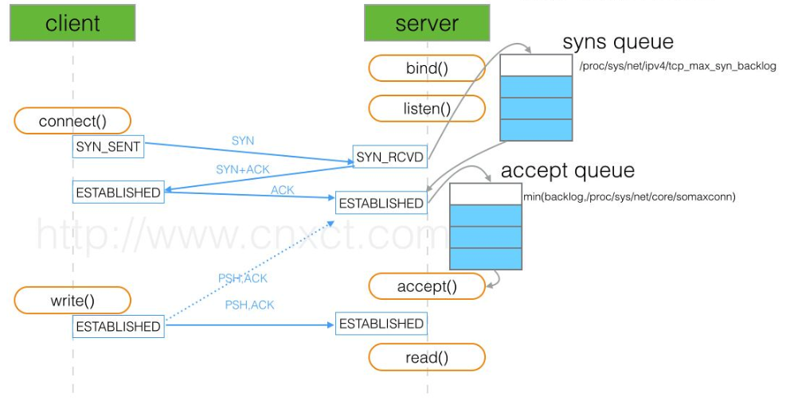

* ChannelOption.SO_BACKLOG
	* 对应的是tcp/ip协议listen函数中的backlog参数，函数listen(int socketfd,int backlog)用来初始化服务端可连接队列，服务端处理客户端连接请求是顺序处理的，所以同一时间只能处理一个客户端连接，多个客户端来的时候，服务端将不能处理的客户端连接请求放在队列中等待处理，backlog参数指定了队列的大小。
	* 服务器TCP内核内，维护了两个队列，称为A队列和B 队列，如果A+B的长度大于Backlog时，新的连接就会呗TCP内核拒绝掉。所以，如果backlog过小，就可能出现Accept的速度跟不上，A,B队列满了，就会导致客户端无法建立连接。需要注意的是，backlog对程序的连接数没影响，但是影响的是还没有被accept取出的连接
* linux backlog


```
TCP建立连接是要进行三次握手，但是否完成三次握手后，服务器就处理（accept）呢？

backlog其实是一个连接队列，在Linux内核2.2之前，backlog大小包括半连接状态和全连接状态两种队列大小。

半连接状态为：服务器处于Listen状态时收到客户端SYN报文时放入半连接队列中，即SYN queue（服务器端口状态为：SYN_RCVD）。

全连接状态为：TCP的连接状态从服务器（SYN+ACK）响应客户端后，到客户端的ACK报文到达服务器之前，则一直保留在半连接状态中；
当服务器接收到客户端的ACK报文后，该条目将从半连接队列搬到全连接队列尾部，
即 accept queue （服务器端口状态为：ESTABLISHED）。

在Linux内核2.2之后，分离为两个backlog来分别限制半连接（SYN_RCVD状态）队列大小和全连接（ESTABLISHED状态）队列大小。

SYN queue 队列长度由 /proc/sys/net/ipv4/tcp_max_syn_backlog 指定，默认为2048。

Accept queue 队列长度由 /proc/sys/net/core/somaxconn 和使用listen函数时传入的参数，二者取最小值。默认为128。
在Linux内核2.4.25之前，是写死在代码常量 SOMAXCONN ，在Linux内核2.4.25之后，
在配置文件 /proc/sys/net/core/somaxconn 中直接修改，
或者在 /etc/sysctl.conf 中配置 net.core.somaxconn = 128 
```

